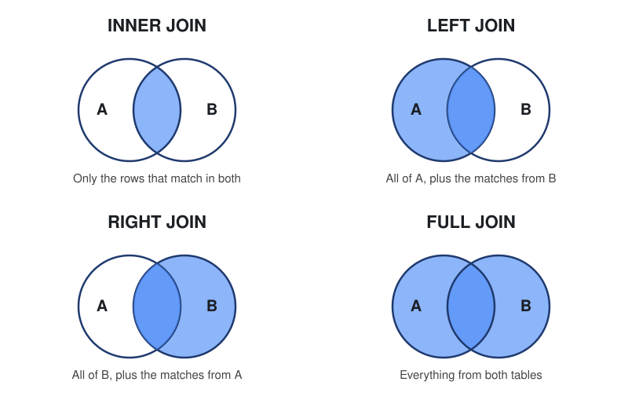

# What are JOINs?
- Joins are used to combine matched rows from two or more tables
- e.g. rows from multiple tables: joins are how we combine rows from two or more tables of matching data and create a new table
- The new table only exists in the result of your query, the original tables are not changed
- Tables are linked using a column they have in common (usually an ID)
- Primary key = the column that uniquely identifies each row in a table (e.g. customer_id in customers)
- Foreign key = a column in another table that points back to that primary key (e.g. customer_id in orders)
- The type of join is decided by what you want back

## How do JOINs work?
- SQL takes the two tables and looks at the column you tell it to match on (the ON part)
- If the values match, the two rows get stitched together into one row in the result
- What happens to rows that don't have a match is what separates the different types of join
- You can think of the two tables as two circles in a Venn diagram. 
    - A is the left table (the one after FROM)
    - B is the right table (the one after JOIN). 
    - The shaded part is what you get back





Basic structure:

```sql
SELECT columns
FROM table_a
JOIN table_b
    ON table_a.id = table_b.a_id;
```

- FROM = the left table
- JOIN = the right table
- ON = the column the two tables are matched on

- If a column name exists in both tables, put the table name in front (customers.name) so SQL knows which one you mean

## INNER JOIN

- Most common is Inner Join: middle of the Venn diagram
- Essentially the intersection, the common things in two tables
- Only returns rows that have a match in both tables
- If a row has no match on the other side, it gets left out completely
- If you just write JOIN on its own, SQL treats it as an INNER JOIN

```sql
SELECT columns
FROM table_a
INNER JOIN table_b
    ON table_a.id = table_b.a_id;
```
## LEFT JOIN

- Gives you everything from the left table and the matched / in common rows from the right table
- If a row in the left table has no match, it still shows up, and the right table columns are filled with NULL
- Good for questions like "show me all customers, and their orders if they have any"

```sql
SELECT columns
FROM table_a
LEFT JOIN table_b
    ON table_a.id = table_b.a_id;
```

## RIGHT JOIN

- Gives you everything from the right table and the matched rows from the left table
- It is the same as a LEFT JOIN, just the other way round
- If a row in the right table has no match, it still shows up, and the left table columns are filled with NULL
- In practice most people just swap the table order and use a LEFT JOIN, because it is easier to read

```sql
SELECT columns
FROM table_a
RIGHT JOIN table_b
    ON table_a.id = table_b.a_id;
```

## FULL JOIN

- Returns all rows from both tables
- Rows that match get combined, rows with no match still show up with NULL on the side that is missing
- Need a column that is present in both tables to match on
- Think of it as LEFT JOIN and RIGHT JOIN put together

```sql
SELECT columns
FROM table_a
FULL JOIN table_b
    ON table_a.id = table_b.a_id;
```
## Summary
- INNER JOIN = only the matches
- LEFT JOIN = everything from the left table + matches
- RIGHT JOIN = everything from the right table + matches
- FULL JOIN = everything from both
- Joins let you keep data in clean separate tables and still combine it whenever you need to

# Task
1. Customers Orders List
Show all customers and their Order IDs

```sql
SELECT c.CompanyName, o.OrderID
FROM Customers c
INNER JOIN Orders o
    ON  c.CustomerID =  o.CustomerID;
```

2. Orders with Customer Names
Show OrderID, OrderDate, and CompanyName.

```sql 
SELECT o.OrderID, o.OrderDate, c.CompanyName
FROM Orders o
INNER JOIN Customers c
    ON o.CustomerID = c.CustomerID;
```

3. Orders with Product Names
Show OrderID, ProductName, and Quantity.

```sql 
SELECT o.ORDERID, p.ProductName, od.Quantity
FROM Orders o
INNER JOIN [Order Details] od
    ON o.OrderID = od.OrderID
INNER JOIN Products p
    ON od.ProductID = p.ProductID;
```

4. Order Totals
Calculate the total value of each order.

```sql 
SELECT o.OrderID, SUM(od.UnitPrice * od.Quantity) AS TotalPrice
FROM Orders o
INNER JOIN [Order Details] od
    ON o.OrderID = od.OrderID
GROUP BY o.OrderID;
```

5. Total Spend per Customer
Show each customer and how much they’ve spent in total.

```sql 
SELECT c.CompanyName, SUM(od.Quantity * od.UnitPrice) As TotalValue
FROM Customers c
INNER JOIN Orders o 
    ON c.CustomerID = o.CustomerID
INNER JOIN [Order Details] od 
    ON o.OrderID = od.OrderId 
GROUP BY c.CompanyName
ORDER BY TotalValue DESC;
```

6. Customers with No Orders
Find customers who have never placed an order.

```sql
SELECT c.CompanyName
FROM Customers c 
LEFT JOIN Orders o 
    ON c.CustomerID = o.CustomerID
WHERE o.OrderID = NULL;
```

7. Products Never Ordered
Find products that have never been sold.

```sql
SELECT p.ProductName
FROM Products p
LEFT JOIN [Order Details] od
    ON p.ProductID = od.ProductID
WHERE od.ProductID IS NULL;
```

8. Orders per Employee
Show each employee and how many orders they handled.

9. Top 5 Customers by Spend
Show the top 5 customers based on total spend.

10. Revenue by Category
Show total revenue for each product category.

11. Full Order Breakdown
Create a table showing:

OrderID
Customer Name
Product Name
Quantity
Unit Price


12. Advanced — Average Order Value per Customer
For each customer, show:

Number of orders
Total spend
Average order value


13. Employees with No Orders
Same pattern as customers with no orders

14. Most Popular Product
Which product has been ordered the most (by quantity)?

15. Orders with Shipping Company
Show OrderID and the name of the shipper