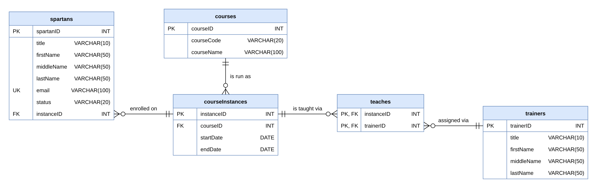

# SQL Practical Exercise: Sparta Global Courses and Spartans

Database: Microsoft SQL Server. Tables: `courses` and `spartans`.

## 1.1 Create the tables

**Task:** Write the SQL statements to create the Course table (Course ID, Course Name, Trainer, Start Date, plus any other columns) and the Spartans table (ID, First Name, optional Middle Name, Last Name, plus a foreign key column linking each Spartan to the Course table).

```sql
CREATE TABLE courses
(
    courseID   INT IDENTITY(1,1) PRIMARY KEY,
    courseName VARCHAR(50)  NOT NULL,
    trainer    VARCHAR(100) NOT NULL,
    startDate  DATE         NOT NULL
);

CREATE TABLE spartans
(
    spartanID  INT IDENTITY(1,1) PRIMARY KEY,
    firstName  VARCHAR(50) NOT NULL,
    middleName VARCHAR(50) NULL,
    lastName   VARCHAR(50) NOT NULL,
    courseID   INT,
    FOREIGN KEY (courseID) REFERENCES courses(courseID)
);
```

---

## 1.2 Add data

**Task:** Add fictional Courses and Spartans to the tables.

Courses first, because the Spartans refer to them.

```sql
INSERT INTO courses (courseName, trainer, startDate)
VALUES
    ('Data',               'Priya Natarajan',   '2026-01-12'),
    ('AI Engineering',     'Marcus Oyelaran',   '2026-03-09'),
    ('Business Solutions', 'Hannah Brightwell', '2026-05-18'),
    ('Java Test',          'Daniel Okafor',     '2026-07-06'),
    ('Devops',             'Sofia Lindqvist',   '2026-09-14');
```

Then the Spartans (`courseID` is 1 to 5):

```sql
INSERT INTO spartans (firstName, middleName, lastName, courseID)
VALUES
    ('Amara',    'Grace',   'Okonkwo',   1),
    ('Liam',     NULL,      'Henderson', 2),
    ('Priyanka', 'Devi',    'Sharma',    3),
    ('Tobias',   NULL,      'Fletcher',  4),
    ('Zainab',   'Aisha',   'Mohammed',  5),
    ('Callum',   'James',   'Reid',      1),
    ('Sofia',    NULL,      'Marchetti', 2),
    ('Jamal',    'Anthony', 'Brooks',    3),
    ('Eilidh',   NULL,      'MacLeod',   4),
    ('Wei',      'Jun',     'Zhang',     5),
    ('Naomi',    NULL,      'Adeyemi',   1),
    ('Oscar',    'Leo',     'Lindgren',  2);
```

**Check**

```sql
SELECT * FROM courses;
SELECT * FROM spartans;
```

---

## 1.3 Modify the tables

The tables are in use, so every change uses `ALTER TABLE` (and `UPDATE` where needed), and a `SELECT` after each change confirms it worked.

### 1. Add a Title column

**Task:** Add a Title column to Spartans (e.g. Mr, Ms, Mx, Dr), then update the existing rows so every one has a title.

```sql
ALTER TABLE spartans
ADD title VARCHAR(10) NULL;
GO

UPDATE spartans SET title = 'Ms' WHERE firstName IN ('Amara', 'Priyanka', 'Zainab', 'Sofia', 'Eilidh', 'Naomi');
UPDATE spartans SET title = 'Mr' WHERE firstName IN ('Liam', 'Tobias', 'Callum', 'Oscar');
UPDATE spartans SET title = 'Dr' WHERE firstName = 'Jamal';
UPDATE spartans SET title = 'Mx' WHERE firstName = 'Wei';
GO
```

**Check:** the second query should return no rows, which means every Spartan has a title.

```sql
SELECT spartanID, title, firstName, lastName FROM spartans;
SELECT * FROM spartans WHERE title IS NULL;
```

---

### 2. Add a CHECK constraint on Title

**Task:** Add a CHECK constraint so Title only accepts values from an agreed list. Test it with an invalid title and note the error message.

```sql
ALTER TABLE spartans
ADD CONSTRAINT CK_spartans_title CHECK (title IN ('Mr', 'Mrs', 'Ms', 'Miss', 'Mx', 'Dr'));
GO
```

**Test with an invalid title.** This insert should fail:

```sql
INSERT INTO spartans (title, firstName, lastName, courseID)
VALUES ('Sir', 'Test', 'Person', 1);
```

**Error message to note down:**

```text
Msg 547, Level 16, State 0
The INSERT statement conflicted with the CHECK constraint "CK_spartans_title".
The conflict occurred in database "<your database>", table "dbo.spartans", column 'title'.
```

**Check:** no `Test Person` row should exist.

```sql
SELECT * FROM spartans WHERE lastName = 'Person';
```

---

### 3. Add a unique Email column

**Task:** Add an Email column to Spartans. No two Spartans can share the same email address.

```sql
ALTER TABLE spartans
ADD email VARCHAR(100) NULL;
GO

UPDATE spartans
SET email = LOWER(firstName + '.' + lastName) + '@spartaglobal.com';
GO

ALTER TABLE spartans
ADD CONSTRAINT UQ_spartans_email UNIQUE (email);
GO
```

**Check**

```sql
SELECT spartanID, firstName, lastName, email FROM spartans;
```

**Test:** this should fail, because the email is already taken.

```sql
UPDATE spartans SET email = 'amara.okonkwo@spartaglobal.com' WHERE firstName = 'Liam';
```

---

### 4. Add an End Date column to courses

**Task:** Add an End Date column to Course, with a constraint that stops the end date falling before the start date.

```sql
ALTER TABLE courses
ADD endDate DATE NULL;
GO

UPDATE courses
SET endDate = DATEADD(WEEK, 12, startDate);
GO

ALTER TABLE courses
ADD CONSTRAINT CK_courses_endDate CHECK (endDate >= startDate);
GO
```

**Check**

```sql
SELECT courseID, courseName, startDate, endDate FROM courses;
```

**Test:** this should fail, because the end date is before the start date.

```sql
UPDATE courses SET endDate = '2020-01-01' WHERE courseID = 1;
```

---

### 5. Make Course Name longer

**Task:** Increase the maximum length of Course Name without losing any existing data.

```sql
ALTER TABLE courses
ALTER COLUMN courseName VARCHAR(100) NOT NULL;
GO
```

**Check:** the length should now be 100, and the course names should all still be there.

```sql
SELECT COLUMN_NAME, CHARACTER_MAXIMUM_LENGTH
FROM INFORMATION_SCHEMA.COLUMNS
WHERE TABLE_NAME = 'courses' AND COLUMN_NAME = 'courseName';

SELECT courseID, courseName FROM courses;
```

---

### 6. Add a Status column with a default

**Task:** Add a Status column to Spartans (e.g. Active, Graduated, Withdrawn) with a default of Active. Insert a new Spartan without giving a status, and check the default is applied.

```sql
ALTER TABLE spartans
ADD status VARCHAR(20) NOT NULL
    CONSTRAINT DF_spartans_status DEFAULT 'Active'
    CONSTRAINT CK_spartans_status CHECK (status IN ('Active', 'Graduated', 'Withdrawn'));
GO
```

**Insert a new Spartan without a status:**

```sql
INSERT INTO spartans (title, firstName, middleName, lastName, courseID, email)
VALUES ('Mr', 'Daniel', NULL, 'Cooper', 3, 'daniel.cooper@spartaglobal.com');
GO
```

**Check the default was applied.** Daniel's status should be `Active`:

```sql
SELECT spartanID, title, firstName, lastName, email, status
FROM spartans
WHERE lastName = 'Cooper';
```

---

## Final check

```sql
SELECT * FROM spartans;
SELECT * FROM courses;
```

# Proposed Entity Relationship Diagram
